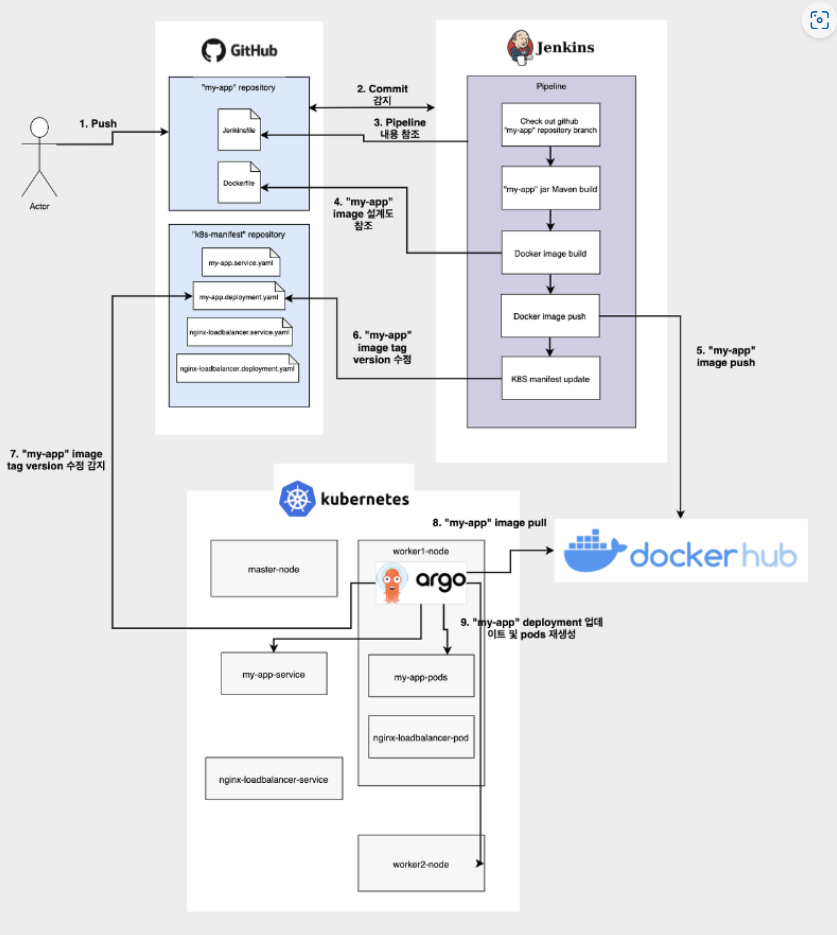

# GCP를 이용한 Jenkins, ArgoCD CI/CD 구현

# gke-argocd-test

💆 CI/CD 체계 구축 개요
1. GCP GKE에 Jenkins 설치 
2. Github에 Jenkinsfile 생성 (단계별 코드 통합 과정 진행) -> Jenkins-Pipeline구축 -> 새로운 이미지 생성 및 태깅 -> Dockerhub Push -> 별도의 manifest repo안 deployment.yaml을 새로운 이미지 태그로 업데이트 -> github
3. webhook를 jenkins에 연동
4. GKE 활성화 및 클러스터 생성 -> ArgoCD 설치 -> ArgoCD 페이지에서 Repository 생성 -> ArgoCD 페이지 에서 Application 생성 -> 배포 자동화 확인
# gke-argocd-test
